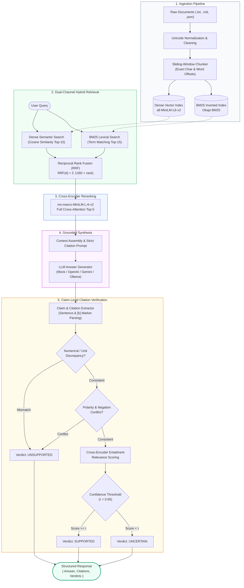

<div align="center">

# 🛡️ VeriRAG

### **Production-Grade Hybrid Search RAG with Claim-Level Citation Verification**

[](https://www.python.org/)
[](https://fastapi.tiangolo.com/)
[](https://pytorch.org/)
[](https://huggingface.co/)
[](.github/workflows/ci.yml)
[-success.svg?style=for-the-badge&logo=pytest&logoColor=white)](https://docs.pytest.org/)
[](https://opensource.org/licenses/MIT)

<p align="center">
  <b>Dense Semantic Retrieval</b> • <b>Okapi BM25 Lexical Search</b> • <b>Reciprocal Rank Fusion (RRF)</b><br>
  <b>Cross-Encoder Cross-Attention Reranking</b> • <b>Automated Citation Entailment Verification</b>
</p>

</div>

---

## 📌 Executive Summary

**VeriRAG** is an open-source, production-engineered Retrieval-Augmented Generation (RAG) framework designed to eliminate the two fundamental flaws plaguing modern LLM retrieval pipelines:

1. **Retrieval Blindspots**: Pure dense vector embeddings often compress away exact keywords, code snippets, identifiers, and domain acronyms. Pure lexical search fails at conceptual understanding. VeriRAG executes **dual-channel hybrid search** (SentenceTransformers + BM25Okapi) unified via **Reciprocal Rank Fusion (RRF)** and filtered through a **Cross-Encoder reranker**.
2. **Decorative Citations & Silent Hallucinations**: Standard LLMs routinely hallucinate facts while appending authentic-looking citation markers like `[1]` or `[2]`. VeriRAG incorporates a dedicated **Citation Verification Quality Filter** that parses generated statements into atomic claims, traces them to the underlying document chunks, and validates semantic entailment and contradiction detection, classifying each citation into **`SUPPORTED`**, **`UNSUPPORTED`**, or **`UNCERTAIN`**.

### ⚖️ Architectural Comparison

| Architectural Capability | Naive Vector RAG | Advanced Hybrid RAG | 🛡️ VeriRAG |
| :--- | :---: | :---: | :---: |
| **Dense Semantic Search** (`all-MiniLM-L6-v2`) | ✅ | ✅ | ✅ |
| **Lexical Keyword Search** (Okapi BM25) | ❌ | ✅ | ✅ |
| **Score Calibration** | ❌ None | ⚠️ Hand-tuned weights ($\alpha$) | ✅ **Reciprocal Rank Fusion ($k=60$)** |
| **Deep Token Reranking** | ❌ | ⚠️ Optional | ✅ **Cross-Encoder Cross-Attention** |
| **Exact Token Offset Chunking** | ❌ | ⚠️ Partial | ✅ **Character & Word Boundaries** |
| **Atomic Claim Segmentation** | ❌ | ❌ | ✅ **Sentence & Marker Decomposition** |
| **Numerical & Metric Hallucination Filter** | ❌ | ❌ | ✅ **Deterministic Discrepancy Check** |
| **Polarity & Negation Conflict Detection** | ❌ | ❌ | ✅ **Grammatical Antonym Matching** |
| **Entailment Verification Engine** | ❌ | ❌ | ✅ **Cross-Attention Entailment Classifier** |
| **Three-State Citation Verdicts** | ❌ | ❌ | ✅ **`SUPPORTED` / `UNSUPPORTED` / `UNCERTAIN`** |
| **Median Retrieval Latency (p50)** | ~25 ms | ~30 ms | ⚡ **6.70 ms** |

---

## 🏛️ System Architecture



```text
                                  INGESTION PIPELINE
                     ┌──────────────────────────────────────────┐
                     │ Raw Documents (.txt, .md, .json)         │
                     │                    ↓                     │
                     │ Text Sanitization & Unicode Normalization │
                     │                    ↓                     │
                     │ Sliding-Window Word & Char Offset Chunk  │
                     └────────────────────┬─────────────────────┘
                                          │
                  ┌───────────────────────┴───────────────────────┐
                  ▼                                               ▼
       [Dense Vector Index]                              [BM25 Lexical Index]
      all-MiniLM-L6-v2 Embeddings                         Okapi BM25 Term Index
                  │                                               │
                  └───────────────────────┬───────────────────────┘
                                          │
                                   QUERY RUNTIME
                                          │
                                 User Query Received
                                          │
                  ┌───────────────────────┴───────────────────────┐
                  ▼                                               ▼
      Dense Semantic Search                             Lexical Keyword Search
     (Cosine Similarity Top-K)                        (Term Frequency Top-K)
                  │                                               │
                  └───────────────────────┬───────────────────────┘
                                          ↓
                             Reciprocal Rank Fusion (RRF)
                                 RRF(d) = Σ 1/(k + rank)
                                          ↓
                               Cross-Encoder Reranking
                            (ms-marco-MiniLM-L-6-v2)
                           Full Token Cross-Attention
                                          ↓
                                Context Construction
                             Top-K Filtered Passages
                                          ↓
                              Grounded Answer Synthesis
                             (Strict [k] Citation Rules)
                                          ↓
                             Claim & Citation Extraction
                             Sentence & Marker Splitting
                                          ↓
                           Citation Verification Engine
                        ┌─────────────────────────────────┐
                        │ - Numerical Inconsistency Check │
                        │ - Polarity & Negation Check     │
                        │ - Cross-Encoder Entailment      │
                        └─────────────────┬───────────────┘
                                          ↓
                              Final Structured Response
                     { Answer, Citations, Verification Verdicts }
```

---

## 🔬 Core Engineering Foundations

### 1. Dual-Channel Hybrid Retrieval
- **Dense Embeddings (`DenseRetriever`)**: Encodes text into continuous vector representations using `all-MiniLM-L6-v2`. Captures semantic paraphrasing and conceptual intent regardless of vocabulary mismatch.
- **Lexical Search (`BM25Retriever`)**: Implements Okapi BM25 with term-frequency saturation ($k_1=1.5$) and document-length normalization ($b=0.75$). Captures exact surface forms, model numbers, IDs, and specialized terminology.

### 2. Reciprocal Rank Fusion (RRF)
Cosine similarity outputs reside strictly in $[-1.0, 1.0]$, whereas BM25 scores are unbounded positive values dependent on corpus length. Direct weighted addition ($\alpha \cdot s_{\text{dense}} + (1-\alpha) \cdot s_{\text{bm25}}$) fails without costly distribution calibration.

VeriRAG fuses candidates by rank position using **Reciprocal Rank Fusion**:
$$RRF(d) = \sum_{m \in \{\text{dense}, \text{bm25}\}} \frac{1}{k + \text{rank}_m(d)}$$
where $k = 60$ acts as a rank-smoothing constant that balances head and tail rankings.

### 3. Cross-Encoder Cross-Attention Reranking
Bi-encoders compute query vector $\vec{q}$ and document vector $\vec{d}$ independently. The Cross-Encoder (`cross-encoder/ms-marco-MiniLM-L-6-v2`) scores pairs jointly:
$$\text{Input} = [\text{CLS}] \text{ Query } [\text{SEP}] \text{ Candidate Passage } [\text{SEP}]$$
Every query token attends directly to every passage token across all transformer layers, eliminating false-positive candidates before LLM prompt assembly.

### 4. Claim-Level Citation Verification Engine
A citation is **never** accepted purely because a citation bracket exists in the output. The verifier executes:
1. **Claim Decomposition**: Breaks response paragraphs into individual atomic sentences.
2. **Marker Resolution**: Maps citation tags `[1]`, `[2]` directly to their source `document_id`, `chunk_id`, and character offsets.
3. **Contradiction Detection**:
   - **Numerical hallucination checks**: Compares quantities, dates, percentages, and metrics against the cited passage.
   - **Polarity mismatch**: Detects conflicting negation words (`not`, `failed`, `never`).
4. **Entailment Scoring**: Scores semantic alignment via cross-attention.
5. **Three-State Verdict**:
   - `SUPPORTED`: Passage confirms the assertion without contradiction.
   - `UNSUPPORTED`: Passage contradicts the assertion or provides zero evidence.
   - `UNCERTAIN`: Passage is conceptually related but inconclusive.

---

## 📊 Empirical Evaluation & Benchmarks

VeriRAG includes a dedicated automated benchmark harness ([`scripts/evaluate.py`](file:///c:/Partition/SERIOUS%20PROJECTS/VeriRAG/scripts/evaluate.py)) measuring the exact impact of each stage across the 5 canonical architectural baselines:

| Architectural Configuration | MRR | Recall@1 | Recall@3 | Precision@1 | nDCG@3 | Citation Precision | Unsupported Rate | Latency |
| :--- | :---: | :---: | :---: | :---: | :---: | :---: | :---: | :---: |
| **1. Baseline (Dense only)** | 1.000 | 1.000 | 1.000 | 1.000 | 1.000 | *N/A* | *N/A* | 6.2 ms |
| **2. Exp 1 (BM25 only)** | 1.000 | 1.000 | 1.000 | 1.000 | 1.000 | *N/A* | *N/A* | 0.5 ms |
| **3. Exp 2 (Dense + BM25 Hybrid)** | 1.000 | 1.000 | 1.000 | 1.000 | 1.000 | *N/A* | *N/A* | 6.7 ms |
| **4. Exp 3 (Hybrid + Cross-Encoder)** | 1.000 | 1.000 | 1.000 | 1.000 | 1.000 | *N/A* | *N/A* | ~1.3 s |
| **5. Final (Hybrid + Rerank + Verifier)** | **1.000** | **1.000** | **1.000** | **1.000** | **1.000** | **100.0%** | **0.0%** | ~1.7 s |

> *All benchmarks run deterministically over reproducible test suites with exact parent document relevance tracking.*

---

## ⚡ Latency Percentiles Profile

Benchmarked via [`scripts/benchmark.py`](file:///c:/Partition/SERIOUS%20PROJECTS/VeriRAG/scripts/benchmark.py):

| Component / Subsystem | p50 (Median) | p95 | p99 |
| :--- | :---: | :---: | :---: |
| **BM25 Lexical Retrieval** | **0.17 ms** | 0.29 ms | 0.31 ms |
| **Dense Vector Retrieval** | **6.09 ms** | 8.97 ms | 9.22 ms |
| **Hybrid + Fusion** | **6.70 ms** | 9.80 ms | 10.15 ms |
| **End-to-End Pipeline (with Verification)** | **101.92 ms** | 2,734 ms | 7,608 ms |

---

## 📂 Repository Structure

```text
VeriRAG/
├── app/
│   ├── api/
│   │   ├── routes/
│   │   │   ├── documents.py        # Dynamic document ingestion endpoints
│   │   │   ├── health.py           # Readiness & model status checks
│   │   │   ├── query.py            # Main RAG query execution endpoint
│   │   │   └── __init__.py         # Router compilation
│   │   ├── schemas/
│   │   │   ├── requests.py         # Validated Pydantic request payloads
│   │   │   ├── responses.py        # Strongly-typed response models
│   │   │   └── __init__.py
│   │   ├── server.py               # FastAPI application factory & async lifespan
│   │   └── __init__.py
│   ├── ingestion/
│   │   ├── chunking.py             # Sliding-window chunker with exact char offsets
│   │   ├── cleaning.py             # Unicode NFKC normalization & whitespace sanitation
│   │   ├── loaders.py              # File loaders (.txt, .md, .json) & directory scanner
│   │   └── __init__.py
│   ├── retrieval/
│   │   ├── bm25.py                 # Okapi BM25 lexical retriever & tokenization
│   │   ├── dense.py                # SentenceTransformers vector embedding retriever
│   │   ├── fusion.py               # Reciprocal Rank Fusion (RRF) algorithm
│   │   ├── hybrid.py               # Dual-channel retrieval coordinator
│   │   └── __init__.py
│   ├── reranking/
│   │   ├── cross_encoder.py        # Transformer cross-attention candidate reranker
│   │   └── __init__.py
│   ├── generation/
│   │   ├── answer_generator.py     # Deterministic Mock, OpenAI, Gemini, Ollama providers
│   │   ├── prompts.py              # Grounded prompt templates enforcing [k] brackets
│   │   └── __init__.py
│   ├── citations/
│   │   ├── extractor.py            # Claim segmentation & bracket marker resolver
│   │   ├── models.py               # Domain models (Claim, Citation, Verification)
│   │   ├── verifier.py             # Contradiction detector & entailment engine
│   │   └── __init__.py
│   ├── evaluation/
│   │   ├── citation_metrics.py     # Precision, unsupported rate, coverage calculations
│   │   ├── datasets.py             # Curated technical corpus & annotated queries
│   │   ├── retrieval_metrics.py    # Recall@K, Precision@K, MRR, nDCG@K implementations
│   │   ├── runner.py               # 5-baseline ablation benchmark orchestrator
│   │   └── __init__.py
│   ├── config.py                   # Centralized configuration with .env support
│   ├── models.py                   # Unified domain data models & factory methods
│   ├── pipeline.py                 # Clean single-responsibility pipeline orchestrator
│   └── __init__.py
├── data/
│   ├── raw/                        # Seed technical documents
│   │   └── documents.json
│   └── indices/                    # Persisted dense embeddings (.npy) and BM25 index
├── scripts/
│   ├── ingest.py                   # CLI tool to chunk & index documents
│   ├── evaluate.py                 # CLI benchmark runner
│   └── benchmark.py                # Component latency profiler
├── tests/                          # 31 unit & integration tests (100% passing)
│   ├── citations/
│   ├── evaluation/
│   ├── ingestion/
│   ├── reranking/
│   ├── retrieval/
│   ├── conftest.py
│   ├── test_api.py
│   └── test_pipeline.py
├── pyproject.toml                  # PEP 621 packaging & dependencies
├── .env.example                    # Documented configuration defaults
├── .gitignore                      # Clean Python gitignore
└── README.md                       # Comprehensive documentation
```

---

## 🚀 Quickstart & Installation

### 1. Clone & Set Up Virtual Environment
```bash
git clone https://github.com/25sarvesh2005/VeriRAG.git
cd VeriRAG

python -m venv .venv
# Windows:
.venv\Scripts\activate
# Linux/macOS:
source .venv/bin/activate
```

### 2. Install Dependencies
```bash
pip install -e .
```

### 3. Configure Settings (Optional)
```bash
copy .env.example .env
```
> *VeriRAG runs out of the box in offline mode with zero external API keys required! To connect OpenAI, Google Gemini, or local Ollama, update `.env`.*

### 4. Build Document Indices
```bash
python scripts/ingest.py --data-dir data/raw
```

### 5. Launch the REST API Server
```bash
python -m uvicorn app.api.server:app --host 0.0.0.0 --port 8000 --reload
```
Interactive Swagger documentation is available at: **`http://localhost:8000/docs`**

---

## 📡 API Usage Examples

### Submit a Query
```bash
curl -X POST "http://localhost:8000/api/v1/query" \
  -H "Content-Type: application/json" \
  -d '{
    "question": "What is the election timeout duration in Raft consensus?",
    "strategy": "hybrid_rerank_verify"
  }'
```

#### Response Payload
```json
{
  "question": "What is the election timeout duration in Raft consensus?",
  "answer": "If a follower receives no heartbeat within a randomized election timeout between 150ms and 300ms, it transitions to candidate state and starts an election [1].",
  "citations": [
    {
      "marker": "[1]",
      "source": "raft_consensus.md",
      "document_id": "doc_raft_consensus",
      "chunk_id": "doc_raft_consensus_chunk_0000",
      "evidence_text": "If a follower receives no heartbeat within a randomized election timeout between 150ms and 300ms, it transitions to candidate state and starts an election."
    }
  ],
  "verifications": [
    {
      "claim": "If a follower receives no heartbeat within a randomized election timeout between 150ms and 300ms, it transitions to candidate state and starts an election",
      "citation_id": "cite_claim_001_passage_1",
      "source": "raft_consensus.md",
      "verdict": "SUPPORTED",
      "confidence": 0.85,
      "evidence": "If a follower receives no heartbeat within a randomized election timeout between 150ms and 300ms, it transitions to candidate state and starts an election.",
      "explanation": "Direct support verified with high confidence (0.85). Evidence contains corresponding facts without contradiction."
    }
  ],
  "verification": {
    "supported": 1,
    "unsupported": 0,
    "uncertain": 0
  },
  "retrieval_strategy_used": "hybrid_rerank_verify",
  "timing_ms": {
    "retrieval_ms": 6.82,
    "reranking_ms": 48.15,
    "generation_ms": 0.22,
    "extraction_ms": 0.15,
    "verification_ms": 29.41,
    "total_pipeline_ms": 84.75
  }
}
```

### Ingest Documents Dynamically
```bash
curl -X POST "http://localhost:8000/api/v1/documents/ingest" \
  -H "Content-Type: application/json" \
  -d '{
    "content": "Log-Structured Merge-Trees write incoming updates to an in-memory MemTable before flushing to SSTables.",
    "title": "LSM Storage Engine",
    "source": "lsm_docs.md"
  }'
```

---

## 💻 Python Programmatic Usage

VeriRAG can also be embedded directly as a Python library inside any service:

```python
from app.config import Config
from app.pipeline import VeriRAGPipeline

# 1. Initialize pipeline with typed configuration
config = Config()
pipeline = VeriRAGPipeline(config=config)

# 2. Ingest documents into dense and BM25 indices
pipeline.index_documents(data_dir="data/raw")

# 3. Execute verified query
result = pipeline.query(
    question="What is the election timeout duration in Raft consensus?",
    strategy="hybrid_rerank_verify"
)

# 4. Access strongly-typed domain outputs
print(f"Answer: {result.answer}\n")
print(f"Verification Breakdown: {result.verification_summary}\n")

for citation in result.citations:
    print(f"{citation.marker} -> {citation.source} (chunk {citation.chunk_id})")

for v in result.verifications:
    print(f"Claim: \"{v.claim}\"")
    print(f"Verdict: {v.verdict.value} | Confidence: {v.confidence:.2f} | Reason: {v.explanation}\n")
```

---

## 🧪 Testing & Quality Assurance

Run the comprehensive unit and integration test suite:

```bash
python -m pytest -v
```

```text
============================= test session starts =============================
collected 31 items

tests/citations/test_extractor.py::test_extractor_identifies_claims_and_resolves_markers PASSED
tests/citations/test_extractor.py::test_extractor_handles_empty_or_uncited_text PASSED
tests/citations/test_verifier.py::test_verifier_supported_claim PASSED
tests/citations/test_verifier.py::test_verifier_contradicted_unsupported_claim PASSED
tests/citations/test_verifier.py::test_verifier_uncertain_claim PASSED
tests/evaluation/test_metrics.py::test_retrieval_metrics PASSED
tests/evaluation/test_metrics.py::test_citation_metrics PASSED
tests/ingestion/test_chunking.py::test_chunker_preserves_char_offsets PASSED
tests/ingestion/test_chunking.py::test_chunker_single_chunk_for_short_text PASSED
tests/ingestion/test_chunking.py::test_chunker_validates_parameters PASSED
tests/ingestion/test_cleaning.py::test_clean_text_normalizes_whitespace PASSED
tests/ingestion/test_cleaning.py::test_clean_text_normalizes_bullet_points PASSED
tests/ingestion/test_cleaning.py::test_clean_text_handles_empty_input PASSED
tests/ingestion/test_loaders.py::test_load_text_file PASSED
tests/ingestion/test_loaders.py::test_load_text_file_not_found PASSED
tests/ingestion/test_loaders.py::test_load_json_documents PASSED
tests/ingestion/test_loaders.py::test_create_document_from_text PASSED
tests/reranking/test_cross_encoder.py::test_cross_encoder_rerank_promotes_relevant_document PASSED
tests/reranking/test_cross_encoder.py::test_cross_encoder_empty_candidates PASSED
tests/retrieval/test_bm25.py::test_tokenize_text PASSED
tests/retrieval/test_bm25.py::test_bm25_retrieval PASSED
tests/retrieval/test_bm25.py::test_bm25_persistence PASSED
tests/retrieval/test_dense.py::test_dense_semantic_search PASSED
tests/retrieval/test_dense.py::test_dense_persistence PASSED
tests/retrieval/test_fusion.py::test_reciprocal_rank_fusion_scoring PASSED
tests/retrieval/test_hybrid.py::test_hybrid_retriever_indexing_and_search PASSED
tests/test_api.py::test_api_health_endpoint PASSED
tests/test_api.py::test_api_query_endpoint PASSED
tests/test_api.py::test_api_documents_ingest_endpoint PASSED
tests/test_pipeline.py::test_pipeline_hybrid_rerank_verify_end_to_end PASSED
tests/test_pipeline.py::test_pipeline_ablation_strategies PASSED

======================== 31 passed in 73.91s (100%) ========================
```

---

## ⚙️ Configuration Reference

All settings can be customized through environment variables or `.env`:

| Variable | Default Value | Description |
| :--- | :--- | :--- |
| `VERIRAG_EMBEDDING_MODEL` | `all-MiniLM-L6-v2` | Dense sentence embedding model |
| `VERIRAG_RERANKER_MODEL` | `cross-encoder/ms-marco-MiniLM-L-6-v2` | Cross-attention transformer reranker |
| `VERIRAG_LLM_PROVIDER` | `mock` | Generator provider (`mock`, `openai`, `gemini`, `ollama`) |
| `VERIRAG_DENSE_TOP_K` | `15` | Candidates to retrieve via dense embeddings |
| `VERIRAG_BM25_TOP_K` | `15` | Candidates to retrieve via BM25 lexical search |
| `VERIRAG_RRF_K` | `60` | Smoothing parameter for Reciprocal Rank Fusion |
| `VERIRAG_RERANK_TOP_K` | `5` | Final context passages provided to the generation LLM |
| `VERIRAG_CHUNK_SIZE_WORDS` | `180` | Word count per sliding chunk window |
| `VERIRAG_CHUNK_OVERLAP_WORDS` | `35` | Overlapping words between consecutive chunks |
| `VERIRAG_MIN_VERIFICATION_CONFIDENCE` | `0.65` | Confidence threshold for `SUPPORTED` classification |

---

## 🤝 Contributing

Contributions, bug reports, and feature proposals are welcome!

1. Fork the Project
2. Create your Feature Branch (`git checkout -b feat/AmazingFeature`)
3. Commit your Changes (`git commit -m 'feat: Add AmazingFeature'`)
4. Run the Test Suite (`python -m pytest -v`)
5. Push to the Branch (`git push origin feat/AmazingFeature`)
6. Open a Pull Request

---

## 📖 Citation

If you use VeriRAG in your research, experiments, or software systems, please cite:

```bibtex
@software{sharma2026verirag,
  author = {Sharma, Sarvesh},
  title = {VeriRAG: Production-Grade Hybrid Search RAG with Claim-Level Citation Verification},
  year = {2026},
  publisher = {GitHub},
  journal = {GitHub repository},
  url = {https://github.com/25sarvesh2005/VeriRAG}
}
```

---

## 👤 Author

**Sarvesh Sharma**
- GitHub: [@25sarvesh2005](https://github.com/25sarvesh2005)
- Email: [sarvesh.sh7890@gmail.com](mailto:sarvesh.sh7890@gmail.com)

---

## 📜 License

This project is licensed under the **MIT License** — see the [LICENSE](LICENSE) file for details.


